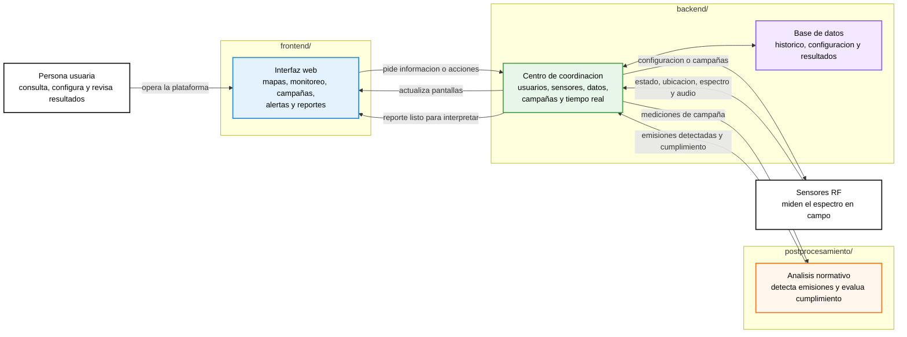

# Plataforma ANE

Este repositorio agrupa la plataforma de sensado espectral de la ANE. En terminos simples, la plataforma permite operar sensores RF, recibir mediciones, analizarlas y convertirlas en informacion util para monitoreo, campañas y reportes de cumplimiento.

La vista general es corta a proposito. Para profundizar en cada parte, hay diagramas especificos en `frontend/`, `backend/` y `postprocesamiento/`.

## Diagrama general: de la medicion al reporte

## Como leer este mapa

La persona usuaria trabaja desde el `frontend/`: ve mapas, estados, monitoreo en vivo, campañas, alertas y reportes.

El `backend/` coordina todo lo que ocurre detras: autentica usuarios, administra sensores y campañas, recibe datos de campo, guarda informacion, avisa cambios en tiempo real y solicita analisis cuando se necesita un reporte.

El `postprocesamiento/` interpreta mediciones de espectro. Detecta emisiones, mide sus parametros y, cuando hay informacion normativa disponible, indica si esas emisiones cumplen, estan fuera de parametros o no tienen licencia asociada.

## Lectura en una frase

La plataforma permite que una persona configure mediciones desde la web, que los sensores midan el espectro, que el backend organice y guarde los datos, y que el modulo Python convierta esas mediciones en resultados de cumplimiento.

## Donde profundizar

- Flujo del frontend: [frontend/DIAGRAM.md](frontend/DIAGRAM.md)
- Flujo del backend: [backend/DIAGRAM.md](backend/DIAGRAM.md)
- Flujo del postprocesamiento: [postprocesamiento/DIAGRAM.md](postprocesamiento/DIAGRAM.md)
- Documentacion del backend: [backend/README.md](backend/README.md)
