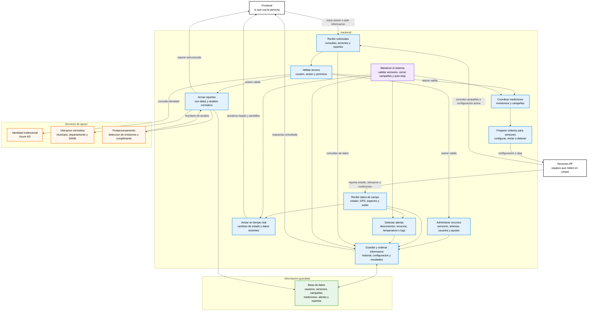

# Flujo general del backend

Este documento resume, en lenguaje simple, que hace el backend de la plataforma ANE. La idea no es explicar el codigo, sino mostrar como el backend hace posible que la medicion, el monitoreo y los reportes funcionen de punta a punta.

## Bloques principales

1. Recibir solicitudes del frontend
2. Validar usuarios y permisos
3. Administrar sensores, antenas, usuarios y configuracion
4. Coordinar monitoreos y campañas
5. Entregar ordenes o configuraciones a sensores
6. Recibir estado, ubicacion, espectro y audio desde sensores
7. Guardar informacion historica
8. Avisar cambios en tiempo real al frontend
9. Detectar alertas operativas
10. Pedir analisis normativo al postprocesamiento
11. Devolver resultados y reportes al frontend

## Diagrama: coordinacion central de la plataforma

## Como leer el diagrama

El backend es el centro de coordinacion. El frontend le pide informacion o acciones, y los sensores le envian datos desde campo. El backend valida quien puede hacer cada cosa, organiza las mediciones, guarda informacion y devuelve al frontend lo que la persona necesita ver.

Cuando se inicia una medicion, el backend prepara la configuracion para el sensor. Cuando el sensor mide, el backend recibe estado, ubicacion, espectro y audio. Parte de esa informacion se muestra en vivo y parte queda guardada para campañas, alertas o reportes.

Cuando se genera un reporte, el backend recoge las mediciones guardadas, valida la ubicacion, pide al postprocesamiento que analice las emisiones y devuelve un resultado listo para interpretar.

## Flujos principales

- `Ingreso`: valida usuarios con Azure AD o acceso administrativo y entrega una sesion de trabajo.
- `Administracion`: gestiona sensores, antenas, usuarios y parametros generales.
- `Monitoreo`: coordina una medicion inmediata y mantiene actualizadas las pantallas.
- `Campañas`: programa mediciones, asigna sensores y cambia estados segun fecha y hora.
- `Datos de campo`: recibe estado, GPS, espectro y audio de los sensores.
- `Alertas`: registra problemas de comunicacion, temperatura, recursos o logs.
- `Reportes`: conecta mediciones, ubicacion y analisis normativo.
- `Mantenimiento automatico`: marca sensores con retraso u offline, cierra campañas y detiene monitoreos vencidos.

## Informacion que guarda el backend

- Usuarios y roles.
- Sensores, antenas y sus relaciones.
- Configuraciones activas de adquisicion.
- Campañas y sensores asignados.
- Estados historicos, ubicaciones GPS y mediciones de espectro.
- Alertas historicas.
- Resultados o cache de reportes cuando aplica.

## Referencias del backend usadas

- Entrada del servidor: `src/app.ts`
- WebSocket general: `src/websocket.ts`
- Audio en vivo: `src/audioServer.ts`
- Base de datos: `src/database/connection.ts`
- Autenticacion: `src/routes/auth.ts`, `src/middleware/auth.ts`, `src/middleware/azureAuth.ts`
- Sensores y datos recibidos: `src/routes/sensor.ts`, `src/models/Sensor.ts`, `src/models/SensorData.ts`
- Sensores, antenas y alertas: `src/routes/management.ts`, `src/models/Antenna.ts`, `src/models/SensorHistoryAlert.ts`
- Campañas: `src/routes/campaign.ts`
- Reportes: `src/routes/reports.ts`
- Configuracion del sistema: `src/routes/config.ts`
