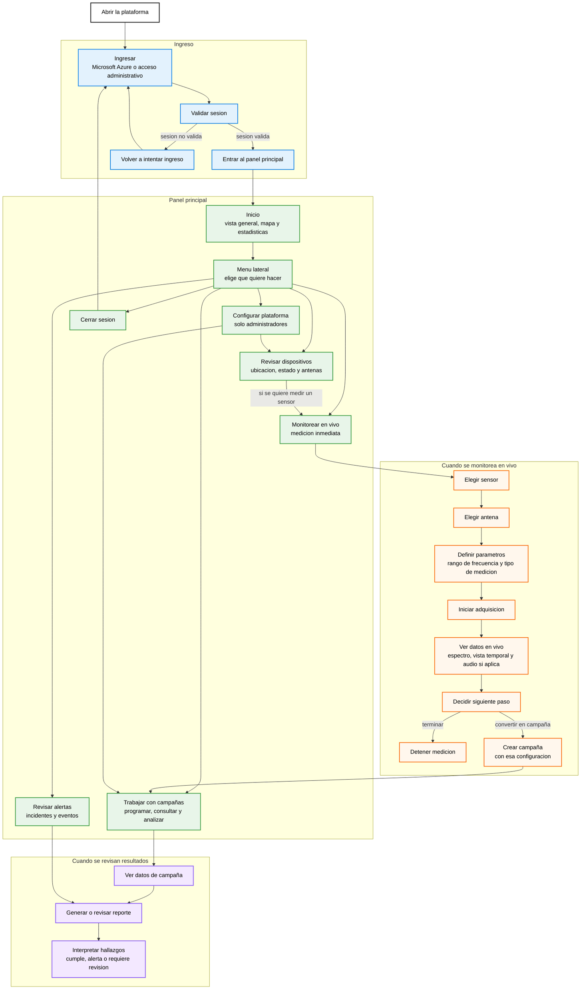

# Flujo general del frontend

Este documento resume, en lenguaje simple, como se recorre el frontend de la plataforma ANE. La idea no es explicar el codigo, sino mostrar que ve y que decide una persona cuando entra a la aplicacion.

## Bloques principales

1. Ingreso a la plataforma
2. Pantalla principal con mapa y estado general
3. Revision de sensores y dispositivos
4. Monitoreo en vivo de una medicion
5. Creacion y consulta de campañas
6. Revision de alertas e incidentes
7. Reportes y resultados de medicion
8. Configuracion administrativa

## Diagrama: recorrido de una persona en la interfaz

## Como leer el diagrama

La persona entra, se autentica y llega a una pantalla principal. Desde ahi decide si quiere revisar el estado general, mirar sensores, iniciar una medicion, trabajar con campañas, revisar alertas o administrar la plataforma.

El flujo central del frontend es la medicion: elegir sensor, elegir antena, definir parametros e iniciar adquisicion. Durante la medicion se ven datos en vivo. Luego se puede detener la medicion o usar esa configuracion para crear una campaña.

Las campañas y alertas llevan a resultados. La persona consulta mediciones, genera o revisa reportes y toma conclusiones sobre lo encontrado.

## Pantallas principales

- `Inicio`: vista general con mapa y estadisticas.
- `Dispositivos`: revision de sensores, ubicacion, estado y antenas asociadas.
- `Monitoreo`: configuracion y visualizacion de una medicion en vivo.
- `Campañas`: programacion, consulta y analisis de mediciones planificadas.
- `Alertas`: revision de eventos o incidentes detectados.
- `Configuracion`: administracion de antenas, sensores, usuarios y parametros generales.
- `Audio`: aparece asociado al monitoreo o a un sensor, no como tarea principal separada.

## Referencias del frontend usadas

- Entrada y rutas: `src/main.tsx`
- Sesion y permisos: `src/contexts/AuthContext.tsx`
- Pantalla principal: `src/App.tsx`
- Menu lateral: `src/components/Sidebar.tsx`
- Ingreso: `src/components/Login.tsx`
- Dispositivos: `src/components/MonitoringNetwork.tsx`
- Monitoreo: `src/components/ConfigurationPanel.tsx`, `src/components/AnalysisPanel.tsx`
- Campañas: `src/components/CampaignsList.tsx`, `src/components/CampaignModal.tsx`, `src/components/CampaignDataViewer.tsx`
- Alertas: `src/components/AlertsPanel.tsx`
- Configuracion: `src/components/AntennaManagement.tsx`, `src/components/UserManagement.tsx`
- Audio en vivo: `src/components/WebRTCAudioPlayer.tsx`, `src/pages/AudioPage.tsx`
