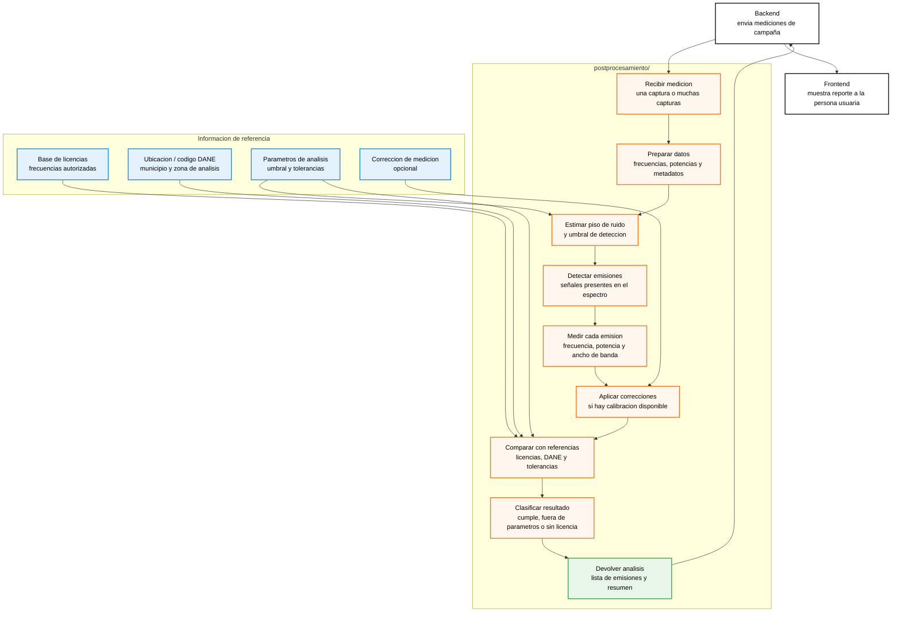

# Flujo general del postprocesamiento

Este documento resume, en lenguaje simple, que hace el modulo `postprocesamiento/`. Su papel es convertir mediciones de espectro en resultados de analisis: emisiones detectadas, parametros medidos y cumplimiento normativo cuando se compara contra informacion oficial.

## Bloques principales

1. Recibir mediciones de espectro desde el backend
2. Preparar la medicion para analisis
3. Detectar emisiones dentro del rango medido
4. Medir frecuencia, potencia y ancho de banda de cada emision
5. Aplicar correcciones o umbrales cuando corresponda
6. Comparar contra informacion normativa por ubicacion
7. Clasificar resultados: cumple, fuera de parametros o sin licencia
8. Devolver resultados al backend para que el frontend muestre el reporte

## Diagrama: de medicion a resultado normativo

## Como leer el diagrama

El postprocesamiento no es la pantalla que ve la persona usuaria. Es el motor de analisis que trabaja cuando el backend necesita interpretar mediciones de espectro.

Primero recibe una medicion o un grupo de mediciones. Luego identifica que partes del espectro parecen contener emisiones reales, mide sus caracteristicas principales y, si se esta generando un reporte normativo, compara esas emisiones con referencias de licencias y ubicacion.

El resultado vuelve al backend como una lista estructurada de emisiones. Con eso, el frontend puede mostrar un reporte entendible: que se detecto, donde, con que potencia, si esta autorizado y si cumple los parametros esperados.

## Modos de uso

- `Deteccion simple`: encuentra emisiones presentes en una medicion.
- `Analisis por picos`: analiza frecuencias especificas indicadas por quien consulta.
- `Cumplimiento normativo`: compara emisiones detectadas contra licencias y ubicacion.
- `Analisis por lote`: procesa muchas mediciones para construir reportes de campaña.

## Resultado esperado

- Numero de emisiones detectadas.
- Frecuencia central de cada emision.
- Potencia medida.
- Ancho de banda estimado.
- Comparacion contra referencias cuando aplica.
- Estado de cumplimiento: cumple, fuera de parametros o sin licencia.

## Referencias del modulo usadas

- Servicio HTTP de analisis: `server_flask.py`
- Procesamiento principal: `src/processor.py`
- Normalizacion de entrada: `src/payload_parser.py`
- Representacion de mediciones: `src/spectrum_frame.py`
- Deteccion y medicion espectral: `src/spectral_analysis.py`, `src/simple_detector.py`
- Calibracion y comparacion: `src/calibration_io.py`, `consolidado_bbdd_asignación.csv`
